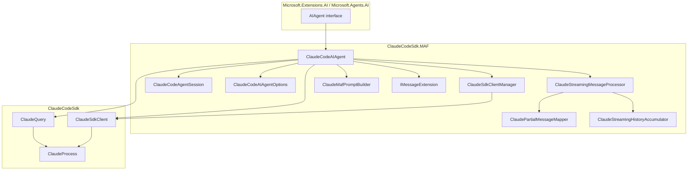
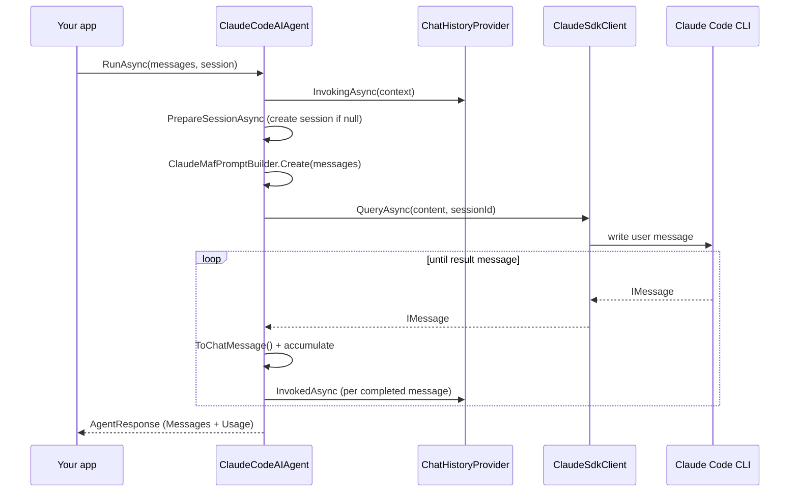
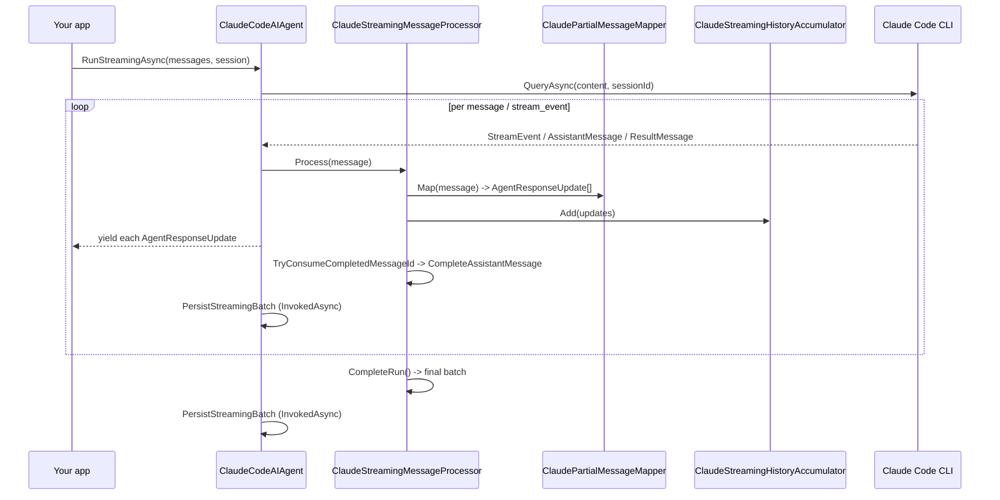
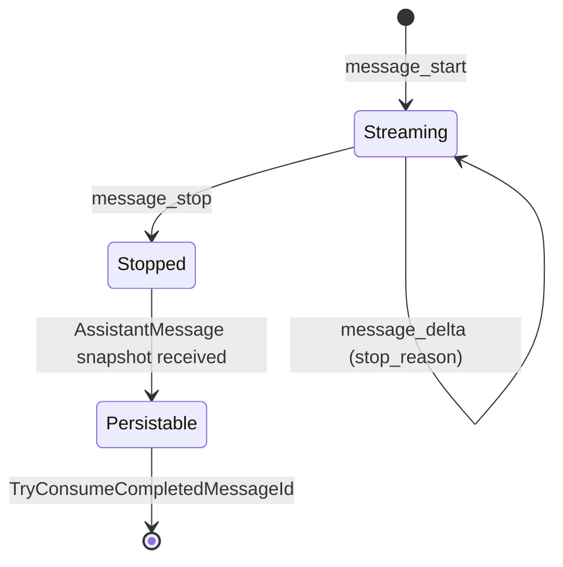
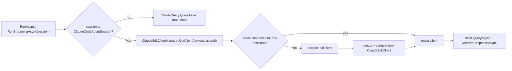
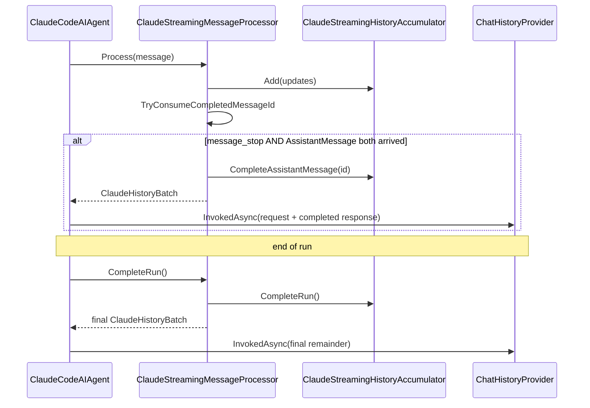

# ClaudeCodeSdk.MAF

Microsoft Agent Framework (MAF) integration for ClaudeCodeSdk, providing an `AIAgent` implementation for Claude Code interactions.

## Overview

This package integrates ClaudeCodeSdk with Microsoft Agent Framework, enabling you to use Claude Code as an AIAgent with full support for:

- ✅ Streaming and non-streaming responses
- ✅ Multi-turn conversations with automatic session management
- ✅ Session serialization/deserialization for persistence
- ✅ Tool use (function calling) support
- ✅ Thinking/reasoning content blocks
- ✅ Image `DataContent` inputs, including image-only messages
- ✅ Usage tracking and cost monitoring
- ✅ Compatible with Microsoft.Extensions.AI interfaces

## Installation

```bash
dotnet add package ClaudeCodeSdk.MAF
```

## Requirements

- .NET 10.0 SDK
- Claude Code CLI installed (`npm install -g @anthropic-ai/claude-code`)
- ANTHROPIC_AUTH_TOKEN environment variable set with your API key

## Quick Start

### Basic Usage

```csharp
using ClaudeCodeSdk.MAF;
using Microsoft.Extensions.AI;

// Create the Claude Code AI Agent
await using var agent = new ClaudeCodeAIAgent();

// Send a simple query
var response = await agent.RunAsync("Hello! Can you help me with C# programming?");
foreach (var message in response.Messages)
{
    if (message.Contents != null)
    {
        foreach (var content in message.Contents)
        {
            if (content is TextContent textContent)
            {
                Console.WriteLine(textContent.Text);
            }
        }
    }
}
```

### Streaming Responses

```csharp
using ClaudeCodeSdk.MAF;
using Microsoft.Extensions.AI;

await using var agent = new ClaudeCodeAIAgent();

await foreach (var update in agent.RunStreamingAsync("Explain async/await in C#"))
{
    if (update.Contents != null)
    {
        foreach (var content in update.Contents)
        {
            if (content is TextContent textContent)
            {
                Console.Write(textContent.Text);
            }
        }
    }
}
```

### Using System Messages for Custom Prompts

You can include System messages in MAF requests, but they are currently ignored by Claude Code transport:

```csharp
using ClaudeCodeSdk.MAF;
using Microsoft.Extensions.AI;

await using var agent = new ClaudeCodeAIAgent();

var messages = new[]
{
    new ChatMessage(ChatRole.System, "You are a helpful C# expert who explains concepts simply."),
    new ChatMessage(ChatRole.User, "What is dependency injection?")
};

var response = await agent.RunAsync(messages);
foreach (var message in response.Messages)
{
    Console.WriteLine(message);
}
```

**Note**: User messages may contain text and image `DataContent`. System messages are not sent as message content; use `ClaudeCodeAIAgentOptions.SystemPrompt` or `AppendSystemPrompt` for global instructions.

### Multi-turn Conversation with Session

```csharp
using ClaudeCodeSdk.MAF;
using Microsoft.Extensions.AI;

await using var agent = new ClaudeCodeAIAgent();

// Create a new session for the conversation
var session = await agent.CreateSessionAsync();

// First turn
var response1 = await agent.RunAsync(
    [new ChatMessage(ChatRole.User, "What is dependency injection?")],
    session: session
);
foreach (var message in response1.Messages)
{
    Console.WriteLine(message);
}

// Second turn - context is preserved via session ID
var response2 = await agent.RunAsync(
    [new ChatMessage(ChatRole.User, "Can you show me an example in C#?")],
    session: session
);
foreach (var message in response2.Messages)
{
    Console.WriteLine(message);
}
```

### Session Persistence

```csharp
using System.Text.Json;
using ClaudeCodeSdk.MAF;
using Microsoft.Extensions.AI;

await using var agent = new ClaudeCodeAIAgent();
var session = await agent.CreateSessionAsync();

// Have a conversation
await agent.RunAsync([new ChatMessage(ChatRole.User, "Hello!")], session: session);

// Serialize the session for later use
var serialized = await agent.SerializeSessionAsync(session);
var json = JsonSerializer.Serialize(serialized);
// Save json to database or file...

// Later: Deserialize and resume
var restored = JsonSerializer.Deserialize<JsonElement>(json);
var restoredSession = await agent.DeserializeSessionAsync(restored);

// Continue the conversation
var response = await agent.RunAsync(
    [new ChatMessage(ChatRole.User, "What did we talk about?")],
    session: restoredSession
);
foreach (var message in response.Messages)
{
    Console.WriteLine(message);
}
```

### Using ChatHistoryProvider

`ClaudeCodeAIAgentOptions.ChatHistoryProvider` lets you plug in custom chat-history storage
(for example: database, Redis, or your own in-memory cache).

At runtime:

- `InvokingAsync(...)` runs **before** the request is sent. Claude Code resumes model history through its provider session ID, so stored messages are not resent as prompt input.
- `InvokedAsync(...)` receives only new request messages plus completed response messages. With partial messages enabled, it can run multiple times during one agent run—once for each safely completed Assistant message and once for any final remainder.
- Streaming updates are yielded immediately. A message becomes persistable only after both `message_stop` and its complete `AssistantMessage` arrive, then its updates are combined with `ToAgentResponse()`. Earlier completed Tool Use rounds remain stored if a later round is interrupted; the incomplete round is discarded.
- `RunAsync(...)` and `RunStreamingAsync(...)` use the same completion and persistence state machine.
- Without partial events, history keeps the compatible end-of-run aggregation fallback.

Typical setup:

```csharp
using ClaudeCodeSdk.MAF;
using Microsoft.Agents.AI;
using Microsoft.Extensions.AI;

// Your ChatHistoryProvider implementation can observe the request in InvokingAsync
// and save new request/response messages in InvokedAsync.
var options = new ClaudeCodeAIAgentOptions
{
    ChatHistoryProvider = new MyChatHistoryProvider(),
    SystemPrompt = "You are a helpful coding assistant."
};

await using var agent = new ClaudeCodeAIAgent(options);
var session = await agent.CreateSessionAsync();

var response = await agent.RunAsync(
    [new ChatMessage(ChatRole.User, "Continue from our previous discussion.")],
    session: session
);
```

> [!TIP]
> Keep passing the same `AgentSession` to preserve thread identity for your `ChatHistoryProvider` storage.

### Advanced Configuration

```csharp
using ClaudeCodeSdk.MAF;
using ClaudeCodeSdk.Types;
using Microsoft.Extensions.Logging;

// Configure Claude Code options
var options = new ClaudeCodeAIAgentOptions
{
    MaxThinkingTokens = 10000,
    SystemPrompt = "You are an expert C# developer.",
    Model = "claude-sonnet-4-5",
    PermissionMode = PermissionMode.acceptEdits,
    ApiKey = "your-api-key" // Or set ANTHROPIC_AUTH_TOKEN environment variable
};

// Optional: Add logging
var loggerFactory = LoggerFactory.Create(builder => builder.AddConsole());
var logger = loggerFactory.CreateLogger<ClaudeCodeAIAgent>();

var agent = new ClaudeCodeAIAgent(options, logger);

var response = await agent.RunAsync("Help me optimize this LINQ query...");
foreach (var message in response.Messages)
{
    Console.WriteLine(message);
}
```

### Working with Tool Calls

When Claude uses tools, the content is automatically converted to MAF types:

```csharp
using ClaudeCodeSdk.MAF;
using Microsoft.Extensions.AI;

await using var agent = new ClaudeCodeAIAgent();

await foreach (var update in agent.RunStreamingAsync("What files are in the current directory?"))
{
    if (update.Contents != null)
    {
        foreach (var content in update.Contents)
        {
            switch (content)
            {
                case TextContent text:
                    Console.WriteLine($"Text: {text.Text}");
                    break;
                case FunctionCallContent funcCall:
                    Console.WriteLine($"Tool: {funcCall.Name}");
                    break;
                case FunctionResultContent result:
                    Console.WriteLine($"Tool Result: {result.Result}");
                    break;
                case TextReasoningContent reasoning:
                    Console.WriteLine($"Thinking: {reasoning.Text}");
                    break;
            }
        }
    }
}
```

### Monitoring Usage and Costs

```csharp
using ClaudeCodeSdk.MAF;
using Microsoft.Extensions.AI;

await using var agent = new ClaudeCodeAIAgent();

var response = await agent.RunAsync("Explain recursion");

// Access usage information
if (response.Usage != null)
{
    Console.WriteLine($"Input tokens: {response.Usage.InputTokenCount}");
    Console.WriteLine($"Output tokens: {response.Usage.OutputTokenCount}");
    Console.WriteLine($"Cached tokens: {response.Usage.CachedInputTokenCount}");

    if (response.Usage.AdditionalCounts != null)
    {
        Console.WriteLine($"Cache read tokens: {response.Usage.AdditionalCounts["cacheReadInputTokens"]}");
    }
}
```

## Architecture

### Architecture Overview

`ClaudeCodeAIAgent` adapts the core SDK to the `AIAgent` contract from `Microsoft.Agents.AI`.
It delegates transport to the core package (`ClaudeQuery` for one-shot calls, `ClaudeSdkClient`
for sessioned calls) and layers a streaming/state pipeline on top: `ClaudePartialMessageMapper`
turns raw `StreamEvent`s into `AgentResponseUpdate`s, `ClaudeStreamingHistoryAccumulator`
buffers them, and `ClaudeStreamingMessageProcessor` decides when a batch is safe to persist via
`ChatHistoryProvider`.



### ClaudeCodeAIAgent

Main class implementing `AIAgent` from Microsoft.Agents.AI:

- **CreateSessionAsync()** - Creates a new conversation session
- **RunAsync()** - Execute a query and get a complete response
- **RunStreamingAsync()** - Execute a query with streaming updates
- **DeserializeSessionAsync()** - Restore a persisted conversation session

### ClaudeCodeAgentSession

Internal session implementation that:
- Maintains session ID for conversation continuity
- Automatically captures session ID from first system message
- Supports serialization for persistence (stores session ID)

### ClaudeCodeAIAgentOptions

Configuration options wrapper that extends ClaudeCodeOptions:

| Property | Description |
|----------|-------------|
| `MaxThinkingTokens` | Maximum tokens for Claude's reasoning (default: 8000) |
| `IncludePartialMessages` | Emit token-level `AgentResponseUpdate` chunks (`false` by default) |
| `SystemPrompt` | Custom system prompt |
| `AppendSystemPrompt` | Additional system prompt to append |
| `Model` | Claude model to use (e.g., "claude-sonnet-4-5") |
| `PermissionMode` | Tool permission mode (`@default`, `acceptEdits`, `plan`, `bypassPermissions`) |
| `CanUseTool` | Async callback for permission requests and `AskUserQuestion` user input |
| `AllowedTools` | List of allowed tools |
| `DisallowedTools` | List of disallowed tools |
| `McpServers` | MCP server configurations |
| `McpServersPath` | Path to MCP servers configuration file |
| `MaxTurns` | Maximum conversation turns |
| `WorkingDirectory` | Working directory for Claude Code CLI |
| `Settings` | Path to settings file |
| `AddDirectories` | Additional directories to include |
| `ApiKey` | Anthropic API key (overrides ANTHROPIC_AUTH_TOKEN) |
| `BaseUrl` | Custom API endpoint (overrides ANTHROPIC_BASE_URL) |
| `EnvironmentVariables` | Additional environment variables |
| `ChatHistoryProvider` | Custom history load/save hook (`InvokingAsync` / `InvokedAsync`) |

### Run Flow (non-streaming)

`RunAsync` collects the full conversation and returns a single `AgentResponse`. With a
`ChatHistoryProvider` configured, it still runs the streaming state machine internally so that
completed messages can be persisted incrementally.



### Streaming Pipeline

`RunStreamingAsync` yields `AgentResponseUpdate`s as they arrive. The processor feeds every
`IMessage` through the mapper, yields the updates immediately, and persists a history batch only
once a message is complete.



With `IncludePartialMessages` enabled, the CLI emits raw `stream_event`s that the mapper
reassembles. A single assistant message progresses through these states:



A message only becomes persistable once **both** `message_stop` and the complete
`AssistantMessage` have arrived — tracked via `_streamStoppedMessageIds` and
`_assistantSnapshotMessageIds`. Already-streamed content blocks are deduplicated through
`EmittedContentIndexes`, so the trailing `AssistantMessage` only emits the content blocks that
were not streamed incrementally.

### Session & Client Lifecycle

The transport is chosen per call: a missing/non-`ClaudeCodeAgentSession` session uses one-shot
`ClaudeQuery`; a real session reuses a connected `ClaudeSdkClient` via
`ClaudeSdkClientManager`, which disposes and reconnects when the session ID changes.



### History Persistence

When `ChatHistoryProvider` is configured, `InvokingAsync` runs before the request (Claude Code
resumes model history by session ID, so stored messages are not resent). `InvokedAsync` then
fires with each safely-completed assistant message plus a final remainder at end of run.



## Content Type Conversions

The integration automatically converts between Claude Code content blocks and MAF AIContent types:

| Claude Content Block | MAF AIContent Type |
|---------------------|-------------------|
| `TextBlock` | `TextContent` |
| `ThinkingBlock` | `TextReasoningContent` |
| `ToolUseBlock` | `FunctionCallContent` |
| `ToolResultBlock` | `FunctionResultContent` |
| `ErrorContentBlock` | `ErrorContent` |

## Key Behaviors

### System Message Handling
- Current implementation forwards only user-message text to Claude Code
- Per-request `ChatRole.System` messages are currently ignored during request construction

### Session Management
- Each AgentSession maintains a `SessionId` that maps to Claude Code's session persistence
- Session IDs are generated when creating/deserializing `ClaudeCodeAgentSession`
- Multi-turn conversations use the session ID passed to `ClaudeSdkClient.QueryAsync(...)`
- AgentSession can be serialized/deserialized with their session ID preserved
- If `ChatHistoryProvider` is configured, the agent calls the invoking hook before each run and may call the invoked hook after each completed Assistant message; Claude Code resumes model history by session ID, while the provider stores staged application history

### Connection Lifecycle
- Non-session calls use one-shot `ClaudeQuery.QueryAsync(...)`
- Session calls reuse a connected `ClaudeSdkClient` per session via `ClaudeSdkClientManager`
- A new client is created when switching sessions or after disconnect/dispose

### Message Processing
- **RunAsync()** - Collects all messages until `ResultMessage` and returns complete response
- **RunStreamingAsync()** - Yields `AgentRunResponseUpdate` for each message received
- Only user-message text is sent to Claude Code

## Important Notes

- **Session Binding**: Conversation continuity is managed through the `AgentSession` you pass to `RunAsync`/`RunStreamingAsync`
- **Session Reuse**: Always pass the same AgentSession object to maintain conversation context across multiple turns
- **API Key**: Set via `ApiKey` property or `ANTHROPIC_AUTH_TOKEN` environment variable
- **Tool Permissions**: Use supported enum values (`@default`, `acceptEdits`, `plan`, `bypassPermissions`)

## Troubleshooting

### "Claude Code CLI not found"
Ensure Claude Code CLI is installed:
```bash
npm install -g @anthropic-ai/claude-code
```

### Authentication Errors
Set your API key:
```bash
export ANTHROPIC_AUTH_TOKEN="your-api-key"
```

Or pass it via options:
```csharp
var options = new ClaudeCodeAIAgentOptions { ApiKey = "your-api-key" };
```

### Session Not Persisting
Ensure you're passing the same session object to all `RunAsync()` calls:
```csharp
var session = await agent.CreateSessionAsync();
await agent.RunAsync([...], session: session); // First turn
await agent.RunAsync([...], session: session); // Second turn uses same session
```

## License

See the main ClaudeCodeSdk repository for license information.
